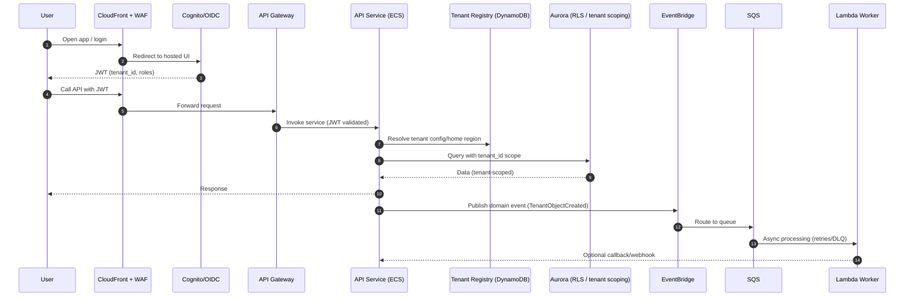

# High-Level Design (HLD) — Global Multi-Tenant SaaS Platform (AWS)

> **Goal:** A production-grade, resume-ready reference architecture for a **global multi-tenant SaaS** with **strong security**, **event-driven workflows**, **observability**, and **disaster recovery**—built to be *deployable*, while you can still keep costs low by running locally / using free-tier and mocked endpoints.

---

## 1) Product scope (what the SaaS does)

### 1.1 What we’re building (core value)
A **multi-tenant SaaS platform** that lets organizations (**tenants**) manage:

- **Users + roles + access** (tenant-aware authentication & authorization)
- **Workspace configuration** (tenant settings, branding, feature flags)
- **Content / data objects** (CRUD + file uploads)
- **Workflow automation** (event-driven rules like “when X happens, do Y”)
- **Notifications** (email/SMS/webhooks)
- **Audit & compliance reporting** (who did what, when, where)

Think: a “TenantOps” platform you could re-skin for many domains (CMS, CRM-lite, internal ops, fundraising, etc.).

### 1.2 Personas
- **Tenant Admin:** manages users, roles, integrations, billing
- **Tenant User:** uses product features (content/workflows)
- **Platform Admin (internal):** tenant onboarding, risk/security ops, support tooling
- **Developer/Integrator:** uses API + webhooks + SDK

### 1.3 Core features (MVP → v1)
**MVP**
- Tenant sign-up + onboarding (trial)
- Auth (SSO optional later), tenant-aware RBAC
- CRUD service for “entities” + file upload
- Workflow engine (simple rules, async jobs)
- Observability + audit logging baseline

**v1**
- Billing/subscriptions + entitlements
- Regional routing + data residency
- Advanced workflows (Step Functions), retries/DLQs
- Search (OpenSearch) + analytics
- DR playbooks + automated failover drills (game days)

---

## 2) Multi-tenancy model (tenant isolation)

### 2.1 Isolation goals
- Prevent **data leakage** across tenants
- Enforce **tenant-aware auth** everywhere (edge → API → data)
- Support **different tenant tiers** (shared vs dedicated resources)
- Support **data residency** (keep EU tenants in EU, etc.)

### 2.2 Chosen approach (practical hybrid)
**Default (most tenants):** *Pooled* compute + *pooled* data with strict logical isolation  
- Every request carries `tenant_id`
- Services enforce tenant scoping at the application layer and at the database layer

**Premium / regulated tenants (optional):** *Cell-based isolation* for data stores  
- Dedicated DB schema or dedicated Aurora cluster
- Dedicated KMS key per tenant
- Dedicated S3 bucket (or bucket prefix with stricter policy)

> This hybrid is “resume gold” because it shows you can balance security/cost and scale.

### 2.3 Tenant identity & routing
- **Auth:** Amazon Cognito (or Auth0 later), with **custom claims** in tokens:
  - `tenant_id`, `roles`, `plan`, `region`
- **Routing:** tenant can be mapped to a **home region** in a Tenant Registry.
- **Tenant Registry:** DynamoDB table (global) storing tenant metadata:
  - `tenant_id`, `home_region`, `data_residency`, `plan`, `status`, `kms_key_arn`, etc.

---

## 3) Architecture diagrams (Mermaid)

### 3.1 High-level global architecture
```mermaid
flowchart LR
  U[Users / Browsers] --> CF[CloudFront]
  CF --> WAF[AWS WAF]
  WAF --> APIGW[API Gateway]
  WAF --> ALB[ALB for Web/App]
  APIGW --> AUTH[Cognito / OIDC]
  APIGW --> SVC[ECS Fargate Microservices]
  ALB --> WEB[Web App (ECS or S3+CF)]

  SVC -->|sync| AUR[Aurora PostgreSQL (Multi-AZ)]
  SVC -->|files| S3[(S3)]
  SVC --> REDIS[ElastiCache Redis]
  SVC --> DDB[(DynamoDB - tenant registry / tokens)]
  SVC --> OS[OpenSearch (search)]
  SVC --> BUS[EventBridge]

  BUS --> SQS[SQS queues]
  SQS --> LAMBDA[Lambda workers]
  BUS --> SFN[Step Functions]
  SFN --> LAMBDA

  SVC --> OBS[CloudWatch + X-Ray/OTel]
  OBS --> GRAF[Managed Grafana]
  OBS --> AMP[Managed Prometheus]

  SEC[Security Hub/GuardDuty/Config/CloudTrail] --- SVC
  SEC --- AUR
  SEC --- S3

  subgraph DR[DR / Backup]
    BKP[AWS Backup + PITR]
    REPL[Cross-region replication (S3 CRR, Aurora replica)]
  end

  AUR --- BKP
  S3 --- REPL
  AUR --- REPL
```

### 3.2 Regional network (VPC + subnets)
```mermaid
flowchart TB
  subgraph Region[Region (e.g., us-east-1)]
    subgraph VPC[VPC 10.0.0.0/16]
      IGW[Internet Gateway]
      subgraph Public[Public Subnets (Multi-AZ)]
        ALB[ALB]
        NAT[NAT Gateway]
      end
      subgraph PrivateApp[Private App Subnets (Multi-AZ)]
        ECS[ECS Fargate Services]
        LBD[Internal Load Balancer (optional)]
      end
      subgraph PrivateData[Private Data Subnets (Multi-AZ)]
        AUR[Aurora]
        REDIS[ElastiCache]
        OS[OpenSearch]
      end
      IGW --> ALB
      ALB --> ECS
      ECS --> AUR
      ECS --> REDIS
      ECS --> OS
      ECS --> NAT --> IGW
    end
  end
```

### 3.3 Request flow (login → API → services → data)


---

## 4) Non-functional requirements (NFRs)

### 4.1 Security
- **Zero trust at the edge:** CloudFront + WAF; enforce TLS everywhere
- **Strong identity:** Cognito/OIDC; short-lived JWT; MFA for admins
- **Tenant isolation:** tenant_id required + enforced; DB row-level security (RLS) or app-level guards (plus tests)
- **Secrets:** AWS Secrets Manager + rotation for DB creds
- **Encryption:** KMS for S3/Aurora; per-tenant KMS key for premium tier
- **Audit:** CloudTrail org trail + app audit logs (immutable storage)

### 4.2 Scaling & performance
- Stateless services on **ECS Fargate** with auto scaling (CPU/RPS)
- Read scaling via Aurora read replicas
- Cache hot paths with Redis
- Async workloads via EventBridge/SQS/Lambda
- Rate limiting + throttling at API Gateway

### 4.3 Availability & resilience
- Multi-AZ for ALB/ECS/Aurora/Redis/OpenSearch
- Circuit breakers + retries with jitter; DLQs for async
- Health checks & automated rollbacks in CI/CD
- Graceful degradation (read-only mode, feature flags)

### 4.4 Cost controls (important for your “don’t deploy big cost” rule)
- Feature-flag expensive services (OpenSearch, NAT-heavy egress)
- Use serverless for bursty jobs (Lambda)
- Prefer VPC endpoints where possible to reduce NAT costs
- Budget alarms + cost anomaly detection

### 4.5 Compliance & governance
- Data residency policy per tenant (home region)
- Logging retention policies (CloudWatch/S3)
- AWS Config rules + Security Hub controls baseline
- PII handling: tokenization/masking (optional), least-privileged access

---

## 5) Service boundaries (microservices + responsibilities)

### 5.1 Microservices list
| Service | Responsibility | Data store |
|---|---|---|
| **Auth/Gateway** | JWT validation, request authz, routing | N/A |
| **Tenant Service** | tenant lifecycle, plans, region mapping, feature flags | DynamoDB + Aurora (optional) |
| **User/Identity Service** | user profiles, RBAC, invitations | Aurora |
| **Entity Service** | CRUD for tenant business objects | Aurora |
| **File Service** | uploads, signed URLs, scanning hooks | S3 + DynamoDB |
| **Workflow Service** | rule definitions, triggers, orchestration | Aurora + EventBridge + Step Functions |
| **Notification Service** | email/SMS/webhooks templates | Aurora + SNS |
| **Audit Service** | audit trail, compliance exports | S3 (immutable) + OpenSearch |
| **Billing Service (v1)** | subscriptions, invoices, usage | Aurora + Stripe integration |
| **Admin Service** | internal tooling, tenant support ops | Aurora |

### 5.2 Domain events (example)
- `TenantCreated`
- `UserInvited`
- `EntityCreated/Updated/Deleted`
- `FileUploaded`
- `WorkflowTriggered`
- `PaymentSucceeded/Failed`

---

## 6) Data strategy (HLD-level)
- **Primary OLTP:** Aurora PostgreSQL (Multi-AZ)
  - `tenant_id` column on all tenant-scoped tables
  - Optional **Row-Level Security (RLS)** policies
- **Object storage:** S3
  - Prefix pattern: `s3://bucket/tenants/{tenant_id}/...`
  - S3 Access Points (optional) for per-tenant access control
- **Metadata/registry:** DynamoDB
  - Tenant registry, idempotency keys, rate-limit counters
- **Search:** OpenSearch (optional / flag)
  - Index per environment; include tenant_id filter

---

## 7) DR strategy (HLD)
- **RPO/RTO targets (example):**
  - Standard: RPO 15 min, RTO 2 hours
  - Premium: RPO 1–5 min, RTO 30–60 min
- **Backups:** AWS Backup + Aurora PITR + S3 versioning
- **Cross-region:** S3 CRR, Aurora cross-region replica
- **Failover:** Route 53 health checks → shift traffic
- **Runbooks:** documented failover + restore drills

---

## 8) Implementation notes (what you’ll code first)
- Start with **Tenant Registry**, **Auth**, **Entity Service**, **Audit baseline**
- Add EventBridge + SQS with one worker flow (e.g., notification)
- Add observability (logs + traces) and security controls early

---

## 9) Deliverables in repo
- `docs/architecture/HLD.md` (this file)
- `docs/architecture/LLD.md` (low-level design)
- `docs/architecture/diagrams/*.md` (diagram sources)

